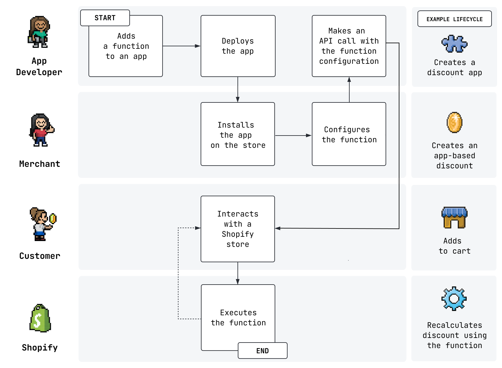

# Shopify Function

Tài liệu chi tiết [tại đây](https://shopify.dev/docs/apps/functions).

Trước năm 2023, các developer muốn thêm hoặc bổ xung tính năng cho Shopify store, ví dụ như giảm giá, thì sẽ phải thủ công can thiệp
vào frontend của Shopify Store, dẫn tới có bugs, hoặc xung đột với các app khác. Hệ thống tính năng của Shopify cho gì phải sử dụng đó, còn các App
thì phải sử dụng trick, hack để đạt được mục đích.

Để khắc phục việc đó, Shopify ra mắt Shopify function cho phép các ứng dụng có thể mở rộng một số nghiệp vụ của Shopify, và các đoạn code này
được viết bằng Rust, Javascript, sau khi được deploy, nó sẽ trở thành một phần tính năng của Shopify.

Dưới đây là hình mô tả về sự tương tác với một ứng dụng sử dụng Shopify Functions

# Examples

- [Discounts](https://shopify.dev/docs/apps/selling-strategies/discounts/experience)
- [Payment customizations](https://shopify.dev/docs/apps/checkout/payment-customizations)
- [Delivery customizations](https://shopify.dev/docs/apps/checkout/delivery-customizations)
- [Cart and checkout validations](https://shopify.dev/docs/apps/checkout/validation/cart-checkout)
- [Order routing location rules](https://shopify.dev/docs/apps/fulfillment/order-management-apps/order-routing)
- [Custom bundles](https://shopify.dev/docs/apps/selling-strategies/bundles/add-a-custom-bundle)
- [Fulfillment constraints](https://shopify.dev/docs/apps/fulfillment/order-management-apps/fulfillment-constraints)

# Giới hạn của Shopify Functions

Chi tiết [tại đây](https://shopify.dev/docs/apps/functions#limitations)