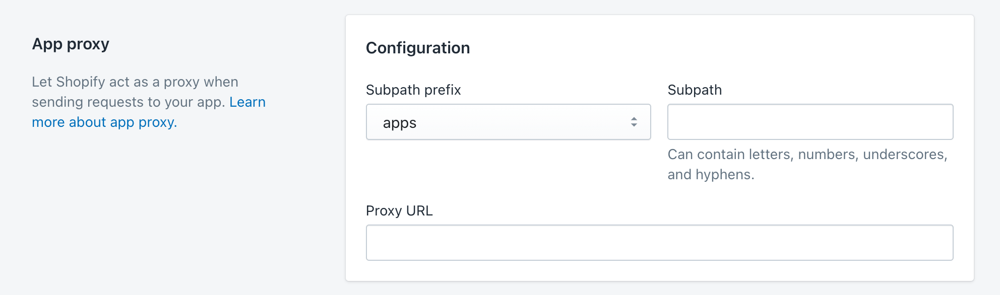

# Shopify app proxy
Có 3 kỹ thuật cơ bản để tích hợp một ứng dụng với phần giao diện của một Shopify Store:
- [ScriptTag](https://shopify.dev/docs/apps/online-store/other-integration-methods/script-tag)
- [App proxies](https://shopify.dev/docs/apps/online-store/app-proxies)
- [Asset resource](https://shopify.dev/docs/apps/online-store/other-integration-methods/asset)

Trong bài này chúng ta tìm hiểu về App Proxy

Cơ chế của App Proxy rất đơn giản, người phát triển app chỉ cần khai báo thông tin trong phần cấu hình App là được. Sau đó
ứng dụng sẽ được nhúng vào Store dưới dạng **IFrame**.

# Techstack

Một Page, sau khi qua Shopify App Proxy sẽ được biên dịch, do vậy, nó cho phép có cả code **Liquid**
trong đó. 

Để sử dụng kỹ thuật này, chúng ta có thể sử dụng:
- React và Liquid
- NextJS và Liquid
- Ruby và Liquid
- PHP và Liquid
- ...

Rất đa dạng cho chúng ta lựa chọn, tuy nhiên phải chú ý một vài điều:
- [Các header không được cho phép](https://shopify.dev/docs/apps/online-store/app-proxies#disallowed-headers)
- Thời gian để 1 page có thể render khi phải qua App Proxy là lâu, làm giảm trải nghiệm khách hàng.
Do đó, khi chuyển hướng trang, tránh việc browser phải reload lại Page, đồng thời nếu dùng NextJS cố gắng tránh server side rendering.
- Nếu Page của chúng ta có liquid, chú ý khai báo headers như sau: [Content-Type: application/liquid](https://shopify.dev/docs/apps/online-store/app-proxies#liquid-response)

