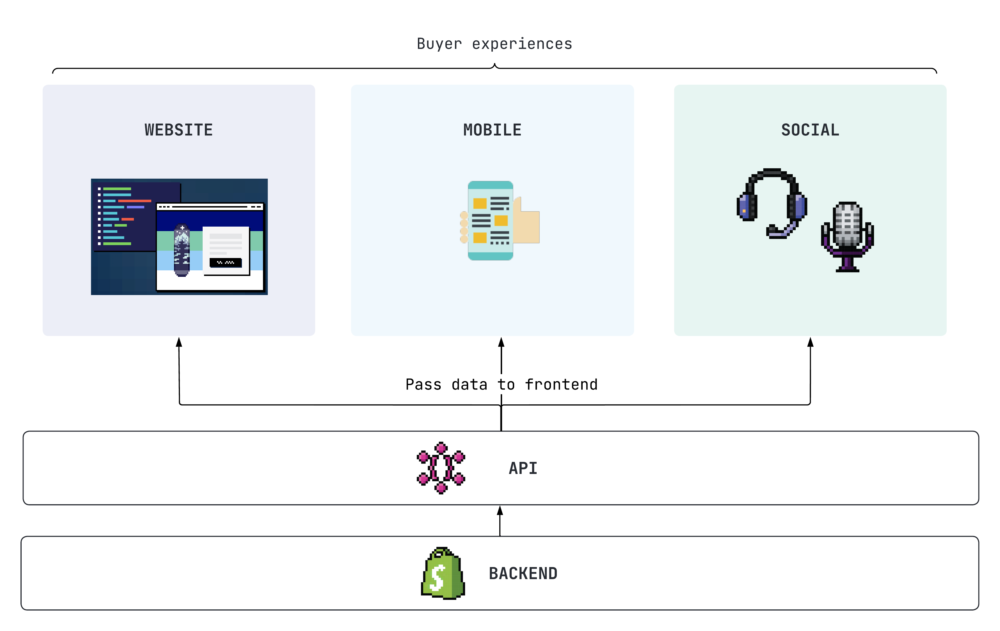
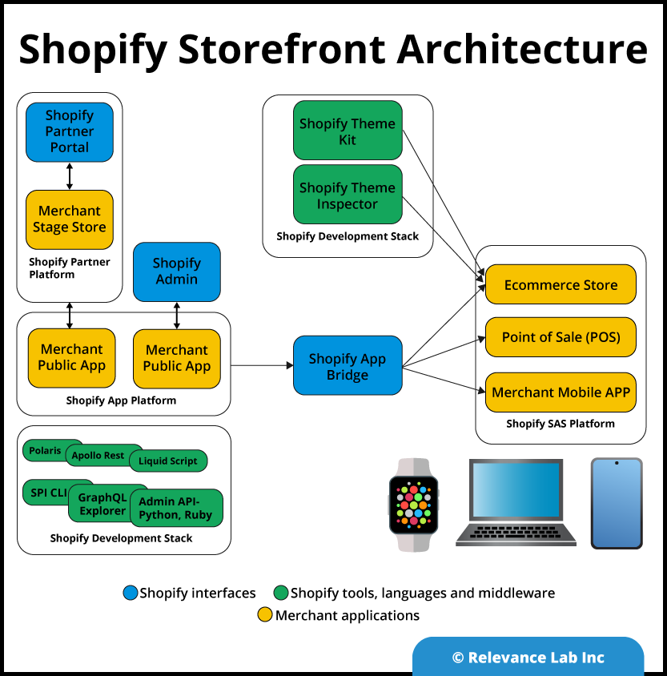

# Architecture
Shopify bao gồm tổ hợp rất nhiều thành phần, mỗi thành phần có một kiến trúc triển khai riêng.

## Mô hình đơn giản

Các ứng dụng đầu cuối của Shopify eco-system đều tương tác với Shopify Backend thông qua hệ APIS.

Chúng ta sẽ tìm hiểu từng thành phần một.

### Storefront architecture

# Technologies

Có thể tham khảo [tại đây](https://stackshare.io/shopify/shopify#stack)

