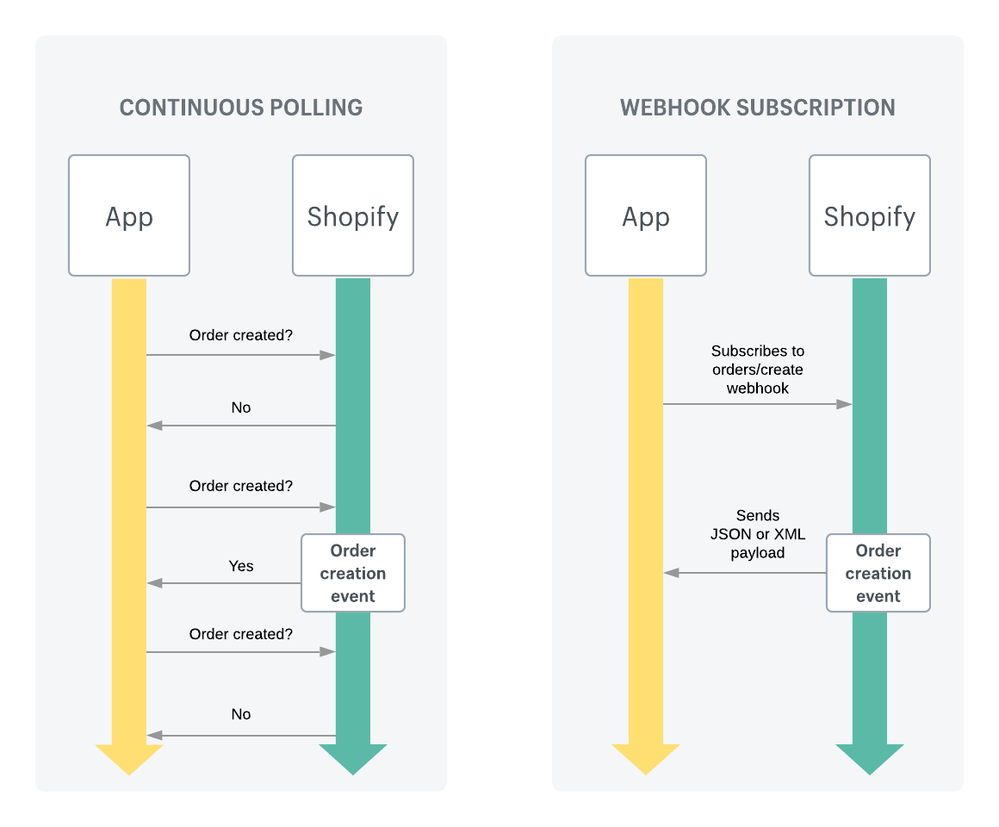

# Shopify Webhooks
Shopify Webhooks cho phép các ứng dụng có thể biết được sự thay đổi nào đã diễn ra phía store khách hàng. Có thể dùng để sync dữ liệu hoặc thực hiện một số thay đổi trong nội bộ ứng dụng.
### Polling  vs Webhooks
Theo cách thông thường người phát triển có thể sử dụng polling để biết khi nào sự thay đổi đã diễn ra và kết thúc, tuy nhiên cách này hiệu xuất kém và tốn tài nguyên. Do vậy việc sử dụng Webhooks là lựa chọn tốt hơn.



### Webhook concepts

- **Webhook**: là một message thông báo khi một event đã sảy ra. Shopify gửi webhook đến cho webhook subscription endpoint đã được đăng ký (bởi ứng dụng). Một webhook chứa a đoạn JSON hoặc XML, và các thông tin metadata khác trong headers.
- **Webhook Topic**: có thể hiểu là một tên định danh cho một loại sự kiện, ví dụ: orders/create. Cách đặt tên này có thể hiểu là domainName/eventName, ví dụ như các sự kiện cùng liên quan tới orders thì chung domainName là **orders**.
- **Webhook Subscription**: là thông tin đăng ký lắng nghe sự kiện mà một app đã tạo, bao gồm 2 thành phần
  - Webhook topic
  - Endpoint: là nơi mà khi có sự kiện sảy ra, webhook sẽ được gửi tới.


Tài liệu chi tiết có thể tra cứu [tại đây](https://shopify.dev/docs/apps/webhooks)

Danh sách các Webhook Topics [ở đây](https://shopify.dev/docs/api/admin-rest/2023-01/resources/webhook#event-topics)

### Code examples

Các đoạn code trên đây chỉ mang tính tham khảo, trên thực tế, có thể không cần sử dụng thư viện, gửi bằng sử dụng Fetch cũng được.

- Đăng ký Webhook
```
const Shopify = require('shopify-api-node');
const dotenv = require('dotenv');

dotenv.config();

const shopify = new Shopify({
  shopName: process.env.SHOP_NAME,
  apiKey: process.env.API_KEY,
  password: process.env.PASSWORD,
});

const webhook = {
  topic: 'orders/create',
  address: 'https://your-app.com/webhooks/orders-create',
  format: 'json'
};

shopify.webhook.create(webhook)
  .then(response => console.log(response))
  .catch(error => console.error(error));

```
- Xử lý dữ liệu trả về từ webhook

Các message và comment được viết bằng tiếng việt để dễ hiểu hơn, tuy nhiên trên thực tế tất cả phải dùng tiếng anh!

```
const express = require("express");
const bodyParser = require("body-parser");

const app = express();

// Thêm middleware cho bodyParser để xử lý request body
app.use(bodyParser.urlencoded({ extended: false }));
app.use(bodyParser.json());

// Endpoint xử lý webhook được gửi từ Shopify
app.post("/webhooks/orders/create", (req, res) => {
  const order = req.body; // Lấy dữ liệu từ request body

  // Thực hiện xử lý dữ liệu tại đây
  console.log("Đã nhận được đơn hàng mới từ Shopify:", order);

  res.status(200).send("OK"); // Trả về 200 OK cho Shopify
});

app.listen(3000, () => {
  console.log("Server đã bắt đầu lắng nghe trên cổng 3000...");
});

```
